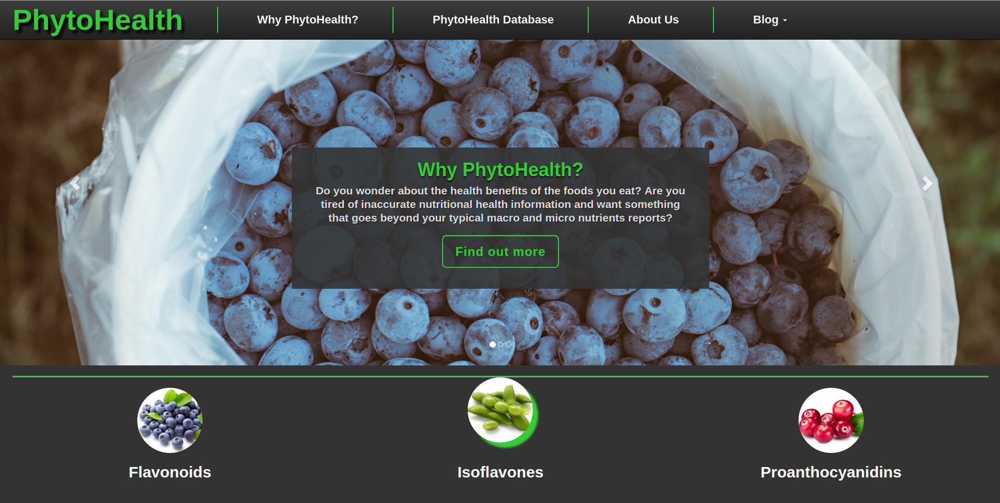

## PhytoHealth Web Application

Please see dev branch for latest code.

Redesign of the [RecipeHealth Web Application](https://github.com/bmb0205/RecipeHealth/) with significant changes to the application's architecture, content, database and overall project goals.

PhytoHealth uses [AngularJS](https://angularjs.org/) as the front-end framework of choice. Technology decisions on the back-end are still undecided, but Java will likely be the the language of choice.

I will soon get a live demo up so anyone can check out the features and responsive design (although likely with a disabled database for now). 

In the mean time, this README will be updated accordingly as the application continues to develop. The end result should be quite awesome and I am looking forward to releasing it when it is ready!

